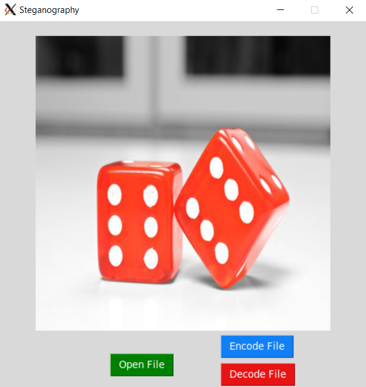

# Steganography

## About

This is a small tool that was made for the purpose of taking data and hiding it within pictures so the only way for anyone to read the data is through a password and the amount of characters that the message has.

## How to use

To encode you must first select a picture and then press "encode" where you will get a prompt for the message and the password

To decode you must select the picture and then press "decode" where you will get a prompt for the amount of characters the message has and the password

